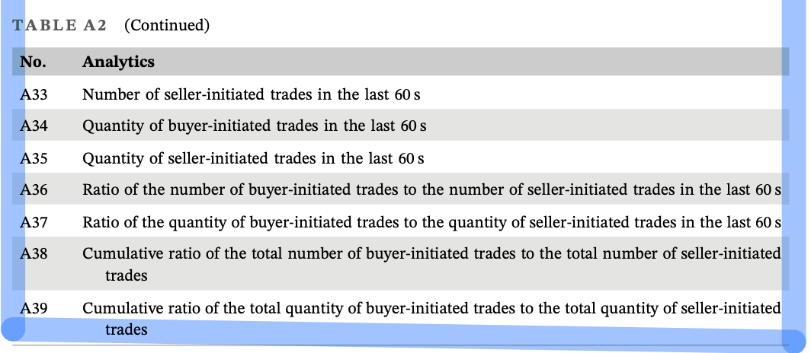
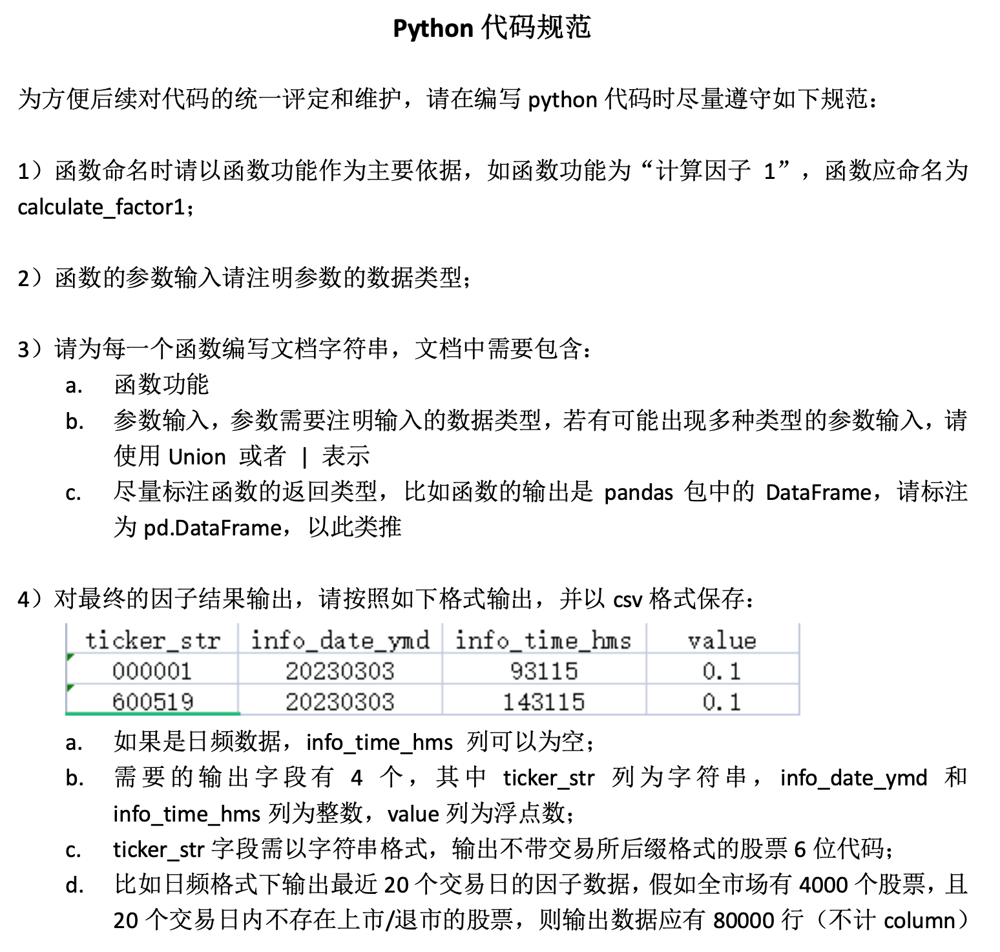

# 基于逐笔委托和逐笔成交数据构造高频因子

量化投资策略设计与分析的第一次作业是基于逐笔数据构造 39 个高频因子。我对高频因子的构造经验比较少，完成这个作业后的一些经验：

1. 高频因子的数据格式是比较标准化的，但也要注意细节：例如空缺时间的填补等。
2. 构造因子的过程本质上是数据处理的过程，常用的方法有：`groupby`、`resample`、`to_datetime`、`reindex`、`rolling`、`apply`等。如果是非常大的数据集，应当用 `numpy` 等更快速的科学计算包，或者用`C++`。

## 39 个因子表达式

用提供的某支证券为期不超过一周的高频数据复制 Table A2 中 39 种指标。


<!-- more -->



## 代码规范要求




## 计算因子的代码

自动更新类和函数中的代码更新，便于调试


```python
%load_ext autoreload
%autoreload 2
```

导入类和函数


```python
from functions import *
```

创建因子生成器的实例 factor_calculator


```python
factor_calculator = FactorCalculator(
    order_path="./data/order_stkhf202101_000001sz.csv",
    trade_path="./data/trade_stkhf202101_000001sz.csv",
    factors_index_path="./factors/factors_index.csv",
)
```

计算所有因子，并分别导出为 csv 文件


```python
# 初始化所有因子
factors = None
# 逐个计算因子，并保存到本地文件，同时将所有因子合并到 factors 这个 DataFrame 中
for i in tqdm(range(1, 39 + 1)):
    # 由于中国股市没有 fill and kill 数据，因此跳过 A9
    if i == 9:
        continue
    Ai = eval("factor_calculator.calculate_A" + str(i))()
    # 保存单个因子到本地文件
    Ai.to_csv("./factors/A" + str(i) + ".csv", index=False)
    # 将单个因子添加到所有因子中
    if factors is None:
        factors = Ai
    else:
        factors["A" + str(i)] = Ai["A" + str(i)]
```

    100%|██████████| 39/39 [00:12<00:00,  3.05it/s]


将所有因子导出为一个 csv 文件


```python
# 将所有因子的 index 转换为 datetime 类型
factors.index = pd.to_datetime(
    factors["info_date_ymd"].astype(str) + " " + factors["info_time_hms"].astype(str),
    format="%Y%m%d %H%M%S",
)
# 保留 9:30-11:30, 13:00-15:00 的数据，即删除 9:15-9:25 的数据
idx1 = factors.index.indexer_between_time("9:30", "11:30")
idx2 = factors.index.indexer_between_time("13:00", "15:00")
factors = factors.iloc[np.union1d(idx1, idx2)]
# 重置索引
factors = factors.reset_index(drop=True)
# 将所有因子保存到本地文件
factors.to_csv("./factors/all_factors.csv", index=False)
```

## 构造因子的函数

见 [GitHub](https://github.com/jeremy-feng/high-frequency-factors/blob/main/functions.py)。
